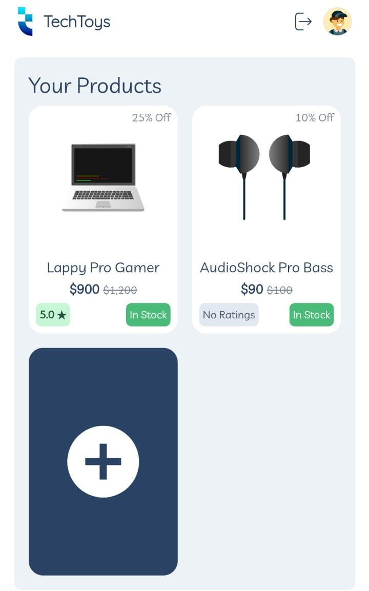
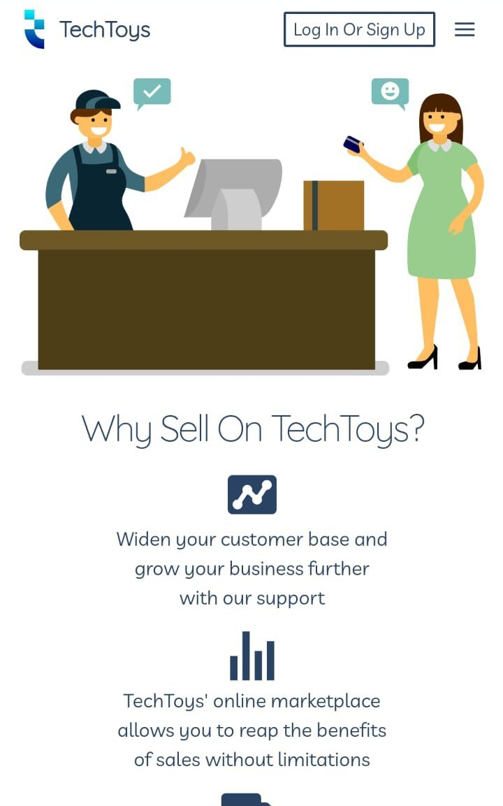
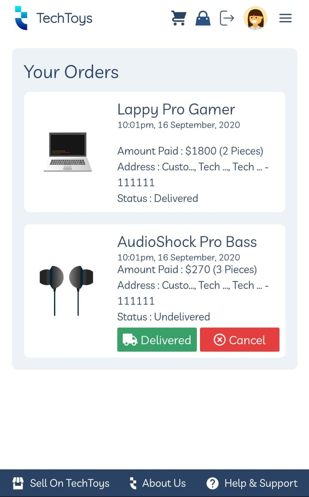
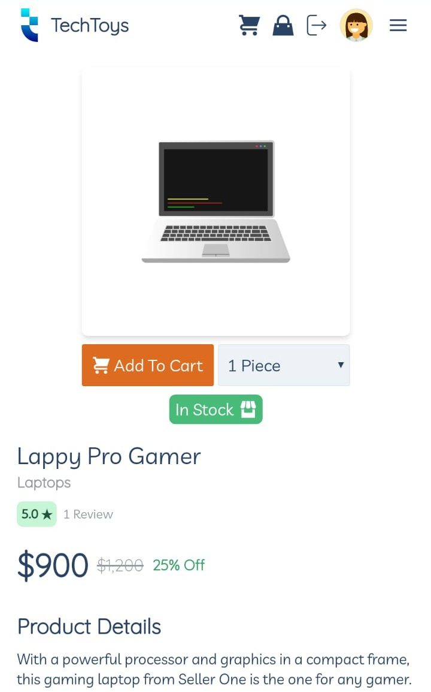

# tech_toys
An e-commerce webapp based on GraphQL using Django and VueJS

On the backend this project uses Ariadne GraphQL library and Django for serving the API whereas the frontend uses Vue.js and TailwindCSS

   
